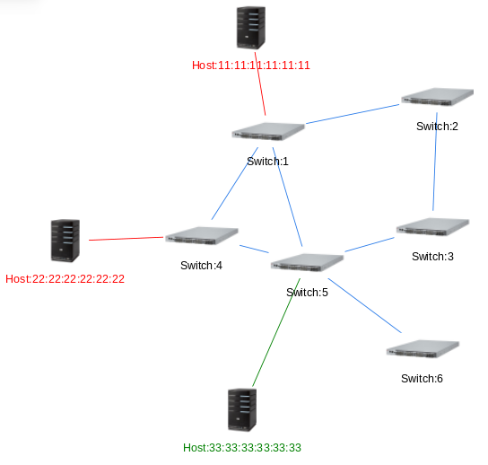

#情報ネットワーク学演習II 12/13 レポート課題
===========
チーム名　owl  
メンバー 秋下 耀介、坂田 航樹、坂本 昂輝、佐竹 幸大、田中 達也、Jens Oetjen、齊藤 卓哉  

## 役割分担
* スライスの分割・統合プログラム、REST APIの作成　坂田
* 可視化のプログラム作成　秋下、坂本
* スライスの分割・統合プログラム、REST APIのレポート作成　坂田
* 可視化部分のレポート作成　秋下、坂本

## 課題 (スライス機能の拡張)
* スライスの分割・結合
	* スライスの分割と結合機能を追加する
* スライスの可視化
	* ブラウザでスライスの状態を表示
* REST APIの追加
	* 分割・統合のできるAPIを追加


## 解答
本課題に取り組むにあたり、実装箇所を以下の２つに切り分けた。
* スライスの分割・統合プログラム、REST API
* 可視化プログラム

以降、それぞれについて説明する。

### スライスの分割・結合
スライスの分割・結合を実装するために`lib/slice.rb`と`bin/slice`を編集した．以降それぞれについて説明する．

####スライスの分割
スライスの分割の仕様を以下のように定めた。
* 分割先として新しいスライスを2つ作成する
* 元のスライスは分割後に削除する
* 元のスライスのすべてのホストがオプションで指定されていなければエラーとしてプログラムを終了する

##### bin/slice
`bin/slice`のソースコードの編集した部分を以下に示す．
```ruby
  desc 'Split a slice into slices'
  arg_name 'orig_slice'
  command :split do |c|
    c.desc 'Split into this slice1'
    c.flag [:i, :into]
    c.desc 'Split into this slice2'
    c.flag [:a, :and]
    c.desc 'Location to find socket files'
    c.flag [:S, :socket_dir], default_value: Trema::DEFAULT_SOCKET_DIR

    c.action do |_global_options, options, args|
      fail 'argument is required.' if args.empty?
      fail '--into option is mandatory.' unless options[:into]
      fail '--and option is mandatory.' unless options[:and]
      slice(options[:socket_dir]).split_slice(args[0], options[:into], options[:and])
      update_slice(options[:socket_dir])
    end
  end
```
このプログラムにより以下のようなコマンドを作成した．
```
./bin/slice split <分割するスライス> --into <分割先1のスライス名>^<分割先1に追加するホスト群> -- and <分割先2のスライス名>^<分割先2に追加するホスト群>
```
ここで、ホスト郡は各ホストのMACアドレスをカンマ(,)で連結したものを表す。
プログラムの前半ではinto, andオプションの設定を，後半では引数やオプションの不足がないのかの判定と分割メソッド`split_slices`を呼び出している．
最後にスライス情報を更新ている．

##### lib/slice.rb
`lib/slice.rb`のソースコードの編集した部分を以下に示す．
```ruby
  def self.split_slice(orig, into1, into2)
    into1_name = into1.split("^")	#[0]:name, [1,2,...]:hosts
    into1_hosts = into1_name[1].split(",")
    into2_name = into2.split("^")
    into2_hosts = into2_name[1].split(",")
    orig_slice = find_by!(name: orig)
    #check
    into_all_hosts = into1_hosts + into2_hosts
    orig_all_hosts = []
    orig_slice.each do |port, mac_addresses|
      mac_addresses.each{|mac_address| orig_all_hosts << mac_address.to_s}
    end
    fail SplitArgumentError, "Split Argument is mistaken" if into_all_hosts.sort != orig_all_hosts.sort
    #create new slices
    create(into1_name[0])
    slice1 = find_by!(name: into1_name[0])
    create(into2_name[0])
    slice2 = find_by!(name: into2_name[0])
    #add hosts to each slices
    orig_slice.each do |port, mac_addresses|
      mac_addresses.each do |mac_address|
        slice1.add_mac_address(mac_address, port) if into1_hosts.include?(mac_address)
        slice2.add_mac_address(mac_address, port) if into2_hosts.include?(mac_address)
      end
    end
    destroy(orig)
    puts "split #{orig} into #{into1} and #{into2}"  
  end
```
ここでは`split_slice`というメソッドを追加している。初めに引数である分割先のスライス及びそのホストをプログラムで扱いやすくするために分割して変数に格納している．#check部では分割するスライスに含まれているホストと分割先の2つに追加するホストとの整合性を確認している．その後，分割先のスライスを作成し，それぞれにホストを追加し，最後に分割したスライスを削除してその旨を出力している．

####スライスの結合
スライスの結合の仕様を以下のように定めた。
* 引数として指定された既存のスライスにオプションで指定されたスライスのホストを追加する
* 結合後、結合したスライスを削除する

##### bin/slice
`bin/slice.rb`のソースコードの編集した部分を以下に示す．
```ruby
  desc 'Merge a slice with a slice'
  arg_name 'orig_slice'
  command :merge do |c|
    c.desc 'Merge slice'
    c.flag [:w, :with]
    c.desc 'Location to find socket files'
    c.flag [:S, :socket_dir], default_value: Trema::DEFAULT_SOCKET_DIR

    c.action do |_global_options, options, args|
      fail 'argument is required.' if args.empty?
      fail '--with option is mandatory.' unless options[:with]
      slice(options[:socket_dir]).merge_slices(args[0], options[:with])
      update_slice(options[:socket_dir])
    end
  end
```
このプログラムにより以下のようなコマンドを作成した．
```
./bin/slice merge <結合先のスライス> --with <結合するスライス>
```
プログラムの前半ではwithオプションの設定を，後半では引数やオプションの不足がないのかの判定と結合メソッド`merge_slices`を呼び出している．
最後にスライス情報を更新ている．

##### lib/slice.rb
`lib/slice.rb`のソースコードの編集した部分を以下に示す．
```ruby
  def self.merge_slices(orig, merg)
    orig_slice = find_by!(name: orig)
    merg_slice = find_by!(name: merg)
    merg_slice.each do |port, mac_addresses|
      mac_addresses.each{|each| orig_slice.add_mac_address(each, port)}
    end
    destroy(merg)
    puts "merge #{orig} with #{merg}"
  end
```
ここでは`merge_slices`というメソッドを追加している。結合するスライスに所属しているホストをすべて結合先のスライスに追加し，結合したスライスを削除し，最後にその旨を出力している．


####　実行結果
動作を確認するためにスライドの一覧表示、スライドの結合、スライドの一覧表示、スライドの分割、スライドの一覧表示の順でコマンドを実行した．
```
ensyuu2@ensyuu2-VirtualBox:~/sliceable-switch-owl$ ./bin/slice list
slice1
  0x1:1
    11:11:11:11:11:11
  0x1:3
    22:22:22:22:22:22
slice2
  0x3:1
    33:33:33:33:33:33
  0x4:1
    44:44:44:44:44:44
ensyuu2@ensyuu2-VirtualBox:~/sliceable-switch-owl$ ./bin/slice merge slice1 --with slice2
ensyuu2@ensyuu2-VirtualBox:~/sliceable-switch-owl$ ./bin/slice list
slice1
  0x1:1
    11:11:11:11:11:11
  0x1:3
    22:22:22:22:22:22
  0x3:1
    33:33:33:33:33:33
  0x4:1
    44:44:44:44:44:44
ensyuu2@ensyuu2-VirtualBox:~/sliceable-switch-owl$ ./bin/slice split slice1 --into slice2^11:11:11:11:11:11,22:22:22:22:22:22 --and slice3^33:33:33:33:33:33,44:44:44:44:44:44
ensyuu2@ensyuu2-VirtualBox:~/sliceable-switch-owl$ ./bin/slice list
slice2
  0x1:1
    11:11:11:11:11:11
  0x1:3
    22:22:22:22:22:22
slice3
  0x3:1
    33:33:33:33:33:33
  0x4:1
    44:44:44:44:44:44
```
以上より，スライスの結合・分割が正しく行われていることが確認された．


### 可視化プログラム
本機能の実装を前回と同様に以下の２つに切り分けた。

* スライス情報の取得およびテキストファイル出力(担当：秋下)
* テキスト情報に基づいたvis.jsによるスライスの表示（担当：坂本）  
それぞれについての説明を以下に示す。

#### <a id="txt_format" style="color: black;">スライス情報のテキストファイル出力</a>
前回までの課題において、ノード（ホストおよびスイッチ）とリンクの情報をテキストファイル（toplogy.txt）に出力する他に、経路情報のファイル(path.txt)を出力するようプログラム（vis.rb）を拡張した。
今回はホストの情報の出力時に追加でスライスの情報を付加したい。そこで、
まず以下のファイルを変更し、スライス情報を保存するようにした。
* [lib/routing_switch.rb](https://github.com/handai-trema/sliceable-switch-owl/blob/develop/lib/routing_switch.rb)
* [vendor/topology/lib/view/topology_controller.rb](https://github.com/handai-trema/sliceable-switch-owl/blob/develop/vendor/topology/lib/topology_controller.rb)
* [vendor/topology/lib/view/topology.rb](https://github.com/handai-trema/sliceable-switch-owl/blob/develop/vendor/topology/lib/topology.rb)
* [bin/slice](https://github.com/handai-trema/sliceable-switch-owl/blob/develop/bin/slice)


また、スライス情報を出力するにあたって、以下のファイルに変更を加えた。
* [vendor/topology/lib/view/vis.rb](https://github.com/handai-trema/sliceable-switch-owl/blob/develop/vendor/topology/lib/view/vis.rb)

以上のファイルの主な変更点について説明を行う。

##### lib/routing_switch.rb
ここでは、`topology_controller`の`update_slice`メソッドを、Sliceを引数として呼び出しているだけである。
```ruby
def update_slice
    @topology.update_slice(Slice.all)
end
```

##### vendor/topology/lib/view/topology_controller.rb
こちらでは、`routing_switch.rb`のように、`topology`の`update_slice`メソッドをsliceを引数として呼び出している。
```ruby
def update_slice(slice)
    @topology.update_slice(slice)
end
```


##### vendor/topology/lib/view/topology.rb
ここではまず、switchの扱いと同様に@slicesというインスタンス変数を用意した。
```ruby
def initialize
    @observers = []
    @ports = Hash.new { [].freeze }
    @links = []
    @hosts = []
    @paths = []
    @slices = []
end

def slices
    @slices
end
```
また、`topology_controller`から呼び出される`update_slice`メソッドは以下のような形で定義した。
```ruby
def update_slice(slice)
    @slices = slice
    maybe_send_handler :update_slice, slice, self
end
```
ここでは、@slicesに保持されているスライス情報を受け取ったsliceに変更している。


##### bin/slice
スライスの変更に関しては、必ずコマンドで操作をすることとなっている。そのため、sliceコマンドが入力された際にコマンドの種類に応じてスライスの情報を更新するような実装とした。
具体的には、各コマンド（listコマンドを除く）に以下の記述を追加した。
```ruby
update_slice(options[:socket_dir])
```
これによってupdate_sliceメソッドが呼び出され、コマンドが実行されるたびにスライスの情報を更新する。
ただし、slice.createを参考にしてプログラム先頭に以下の記述も行った。
```ruby
def self.update_slice(socket_dir)
    Trema.trema_process('RoutingSwitch', socket_dir).controller.update_slice
end
```

##### lib/view/vis.rb
スライス情報をテキストファイルに書き出すが、ホスト情報に付加して出力を行いたい。そこで、まず以下のように変更を加えた。
```ruby
 #host and slice
        file.printf("host\n")
        topology.hosts.each do |each|  #for all host
          slice_info = getSliceInfo(topology, each[0].to_s)
          file.printf("%s Host:%s %s\n",each[0].to_s, each[0].to_s, slice_info)
        end
```
`slice_info`という変数の中をホスト情報のあとに書き出すようにしている。この`slice_info`には`getSliceInfo`メソッドの返り値が入る。
`getSliceInfo`は以下のように定義した。
```ruby
 def getSliceInfo(topology, hostName)
      #print hostName + " for debug slice info \n"
      topology.slices.each do |each_slice|
        each_slice.each do |name, each_port|
          each_port.each do |each|
            if each == hostName
              return each_slice.to_s
            end
          end
        end
      end
    end
```
このメソッドでは、スライス情報の中から、受け取ったホストの所属するスライスを探し出し、その名前を返す。各スライスにはポート単位での管理が行われているため、要素を細かく取り出していく必要がある。そして、macアドレスを比較して、受け取ったホストのmacアドレスと一致していれば、そのスライスの名前を返している。

#####実行結果
まずターミナルで以下のようにコマンドを実行した。

```
ensyuu2@ensyuu2-VirtualBox:~/ensyuu2/work8/sliceable-switch-owl$ ./bin/trema run lib/routing_switch.rb -c trema.conf -- --slicing
```

その後、別ターミナルで、以下のようなコマンドを実行した。

```
ensyuu2@ensyuu2-VirtualBox:~/ensyuu2/work8/sliceable-switch-owl$ bundle exec ./bin/slice add foo
ensyuu2@ensyuu2-VirtualBox:~/ensyuu2/work8/sliceable-switch-owl$ bundle exec ./bin/slice add foo2
ensyuu2@ensyuu2-VirtualBox:~/ensyuu2/work8/sliceable-switch-owl$ ./bin/slice add_host --mac 11:11:11:11:11:11 --port 0x1:1 --slice foo
ensyuu2@ensyuu2-VirtualBox:~/ensyuu2/work8/sliceable-switch-owl$ ./bin/slice add_host --mac 22:22:22:22:22:22 --port 0x4:1 --slice foo
ensyuu2@ensyuu2-VirtualBox:~/ensyuu2/work8/sliceable-switch-owl$ ./bin/slice add_host --mac 33:33:33:33:33:33 --port 0x5:1 --slice foo2
ensyuu2@ensyuu2-VirtualBox:~/ensyuu2/work8/sliceable-switch-owl$ bundle exec ./bin/trema send_packet --source host1 --dest host2
ensyuu2@ensyuu2-VirtualBox:~/ensyuu2/work8/sliceable-switch-owl$ bundle exec ./bin/trema send_packet --source host2 --dest host1
ensyuu2@ensyuu2-VirtualBox:~/ensyuu2/work8/sliceable-switch-owl$ bundle exec ./bin/trema send_packet --source host3 --dest host1
```

このとき、状況を確認するために以下のようにコマンドを実行した。

```
ensyuu2@ensyuu2-VirtualBox:~/ensyuu2/work8/sliceable-switch-owl$ bundle exec ./bin/trema show_stats host1
Packets sent:
  192.168.0.1 -> 192.168.0.2 = 1 packet
Packets received:
  192.168.0.2 -> 192.168.0.1 = 1 packet
ensyuu2@ensyuu2-VirtualBox:~/ensyuu2/work8/sliceable-switch-owl$ bundle exec ./bin/trema show_stats host2
Packets sent:
  192.168.0.2 -> 192.168.0.1 = 1 packet
Packets received:
  192.168.0.1 -> 192.168.0.2 = 1 packet
ensyuu2@ensyuu2-VirtualBox:~/ensyuu2/work8/sliceable-switch-owl$ bundle exec ./bin/trema show_stats host3
Packets sent:
  192.168.0.3 -> 192.168.0.1 = 1 packet
```

上記のことから、スライスfooにはhost1およびhost2が属し、スライスfoo2にはhost3が属しているという状況であると読み取れる。

このとき出力されるテキストファイル（topology.txt）のは以下のようになっている。<a id="output_topology"></a>

```
6 Switch:6
5 Switch:5
4 Switch:4
3 Switch:3
2 Switch:2
1 Switch:1
host
11:11:11:11:11:11 Host:11:11:11:11:11:11 foo
22:22:22:22:22:22 Host:22:22:22:22:22:22 foo
33:33:33:33:33:33 Host:33:33:33:33:33:33 foo2
link
100000 6 5
100001 5 4
100002 5 3
100003 5 1
100004 3 2
100005 1 2
100006 1 4
100007 11:11:11:11:11:11 1
100008 22:22:22:22:22:22 4
100009 33:33:33:33:33:33 5
```

上記より、ホストの情報のあとに正しくスライスの名前が入っていることがわかる。

#### vis.js によるスライス機能の確認

vis.js によってスライス機能を確認するため、以下のファイルを修正した。

* [topology.js](https://github.com/handai-trema/sliceable-switch-owl/blob/develop/vendor/topology/lib/view/topology.js)

修正内容としては、前章で[出力したトポロジー情報](#output_topology)にもとづいて、各ホストが所属するスライスを判定し、vis.js 上で色分けをする。

上記の関連部分を以下に示す。

```javascript
    var colorData = ['red', 'green', 'blue', 'yellow', 'purple', 'pink', 'black'];
    var colorSlice = [];
=============================================
    for (var i=hostBegin; i < linkBegin; i++) {
      if (colorSlice.indexOf(nodejs[i].sp2) >= 0) {
      } else {
        colorSlice.push(nodejs[i].sp2);
      }
      nodeData += "{id:'"+nodejs[i].sp0+"',label:'"+nodejs[i].sp1+"',color:'"+colorData[colorSlice.indexOf(nodejs[i].sp2)]+"', fixed:{x:true, y:true}, font: '14px arial "+colorData[colorSlice.indexOf(nodejs[i].sp2)]+"', shape:'image', image:'./host.jpg', size:30},";
    }
```

ここで用いる定数、変数は次の表の通りである。

| 変数名  | 型  | 意味 |
|:-------------: |:-------------------:| :-------------|
| colorData      | 文字列の１次元配列 | 予め色を格納し、スライスの色分けに利用 |
| colorSlice     | 文字列の１次元配列        | 出現したスライス名を格納 |

これらを用いて色分けを行っていく。

```javascript
    for (var i=hostBegin; i < linkBegin; i++) {
==============<nodeData 整形部分>=============
    }
```

まず、上記の for 文では、[出力したトポロジー情報](#output_topology)における host から link の間、つまりホストの情報を一行ずつ処理している。

```javascript
      if (colorSlice.indexOf(nodejs[i].sp2) >= 0) {
      } else {
        colorSlice.push(nodejs[i].sp2);
      }
```

次に、ここでスライス名が一度出てきたかどうかを判定し、出現していなければ colorSlice に格納しておく。

`nodejs[i].sp2`は、`nodejs[i]`が１行が空白で分割された配列を指し、`sp2`で左から３番目の要素を取り出す。つまり、スライス名のことである。

```javascript
      nodeData += "{id:'"+nodejs[i].sp0+"',label:'"+nodejs[i].sp1+"',color:'"+colorData[colorSlice.indexOf(nodejs[i].sp2)]+"',
       fixed:{x:true, y:true}, font: '14px arial "+colorData[colorSlice.indexOf(nodejs[i].sp2)]+"',
       shape:'image', image:'./host.jpg', size:30},";
```

最後に、各スライスに所属するホスト毎に、ラベルの色を指定する。特に、`font: '14px arial "+colorData[colorSlice.indexOf(nodejs[i].sp2)]+"'`の部分にあたる。ここで、現在みているホストのスライス名を確認し、そのスライス名が colorSlice の何番目の要素なのかを取得する。そして、その要素番号を colorData に指定することで、色の文字列を取得する。

#### 実行結果

実行手順は前回のレポートと同じであるため、割愛する。

vis.js で出力するのは、[topology.txt](#output_topology) とする。

以下が実行結果となる。



以上より、スライス foo に所属する Host11:11:11:11:11:11 と Host:22:22:22:22:22:22 のラベルが赤で表示され、スライス foo2 に所属する Host:33:33:33:33:33:33 のラベルが緑で表示されていることがわかる。

したがって、vis.js によってスライス機能が確認できた。

### REST APIの追加
#### スライスの分割
`lib/rest_api.rb`の編集した部分を以下に示す。
```ruby
  desc 'Split a slice into two slices'
  params do
    requires :orig_slice_id, type: String, desc: 'OriginalSlice ID.'
    requires :split_slice_id1, type: String, desc: 'Split Slice ID1'
    requires :split_slice_id2, type: String, desc: 'Split Slice ID2'
    requires :split_hosts1, type: String, desc: 'Split hosts1'
    requires :split_hosts2, type: String, desc: 'Split hosts2'
  end
  post 'slices/split/:orig_slice_id/:split_slice_id1/split_hosts1/:split_slice_id2/:split_hosts2' do
    rest_api do
      split_arg1 = params[:split_slice_id1] + '^' + params[:split_hosts1]
      split_arg2 = params[:split_slice_id2] + '^' + params[:split_hosts2]
      Slice.split_slice(params[:orig_slice_id], split_arg1, split_arg2)
    end
  end
```
初めにパラメータとして順に、分割元のスライス、分割先のスライス1、分割先のスライス2、スライス1に所属させるホスト郡、スライス2に所属させるホスト郡を設定している。
次にURIの設定を行っている。
最後に、`split_slice`メソッドを呼び出すために、引数の設定を行い、そのメソッドを呼び出している。


#### スライスの結合
`lib/rest_api.rb`の編集した部分を以下に示す。
```ruby
  desc 'Merge a slice with a slice'
  params do
    requires :orig_slice_id, type: String, desc: 'Original Slice ID.'
    requires :merg_slice_id, type: String, desc: 'Merge Slice ID.'
  end
  post 'slices/merge/:orig_slice_id/:merg_slice_id' do
    rest_api do
      Slice.merge_slices(params[:orig_slice_id], params[:merg_slice_id])
    end
  end
```
初めにパラメータとして順に、結合先のスライス、結合するスライスを設定している。
次にURIの設定を行っている。
最後に、`merge_slices`メソッドを呼び出している。

## メモ
実機の設定は前回の設定が残っている。
showコマンドで設定情報を確認すること。
設定用端末のネットワーク設定を逐一確認すること。

### 今後の修正点

* 世代毎の進化
* topology.txt のファイル監視
* REST APIのメソッド名の変更

##参考文献
- デビッド・トーマス+アンドリュー・ハント(2001)「プログラミング Ruby」ピアソン・エデュケーション.  
- [テキスト: 15章 "ネットワークトポロジを検出する"](http://yasuhito.github.io/trema-book/#topology)  
- [Node.js 環境構築](https://liginc.co.jp/web/programming/node-js/85318)
- [Node.js プログラミング入門](http://libro.tuyano.com/index2?id=1115003)
- [Node.js ビギナーズブック](http://www.nodebeginner.org/index-jp.html#javascript-and-nodejs)
- [Vis.js Network Document](http://visjs.org/docs/network/)
